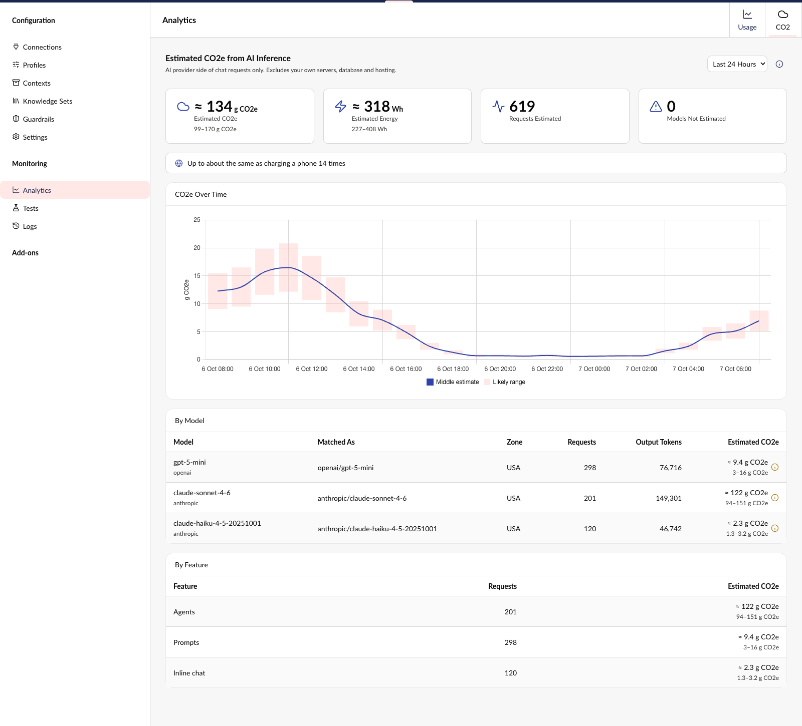

# Umbraco.Community.AI.Carbon

> 🧪 **Pre-release.** In active development. The dashboard works, but the package is not yet published, and settings and wording may still change.

Adds an estimated CO2 dashboard to [Umbraco.AI](https://github.com/umbraco/Umbraco.AI). It reads the usage Umbraco.AI already records and shows the estimated energy and CO2e (carbon dioxide equivalent) of your text generation, by model, by feature and over time. Every energy and CO2e figure is shown as a low-to-high range.



*Screenshot uses sample data.*

**Unofficial community package.** This is a personal project. It is not made, endorsed or supported by Umbraco HQ, and its figures are estimates, not Umbraco's own claims.

## Requirements

- Umbraco CMS 17 (17.4.0 or later) or 18
- Umbraco.AI of the same major (`Umbraco.AI.Core` and `Umbraco.AI.Web`, `17.x` or `18.x`)
- Umbraco.AI usage analytics switched on. They are on by default (`Umbraco:AI:Analytics:Enabled`). The "By feature" split also needs `Umbraco:AI:Analytics:IncludeUsageFeatureTypeDimension`, which is on by default too.

Each Umbraco major has its own version line of this package, which depends on the matching Umbraco CMS and Umbraco.AI major:

| Umbraco CMS | Umbraco.AI | Branch |
|-------------|------------|--------|
| 18 | 18.x | `v18/dev` |
| 17 (17.4.0 or later) | 17.x | `v17/dev` |

This is the Umbraco CMS 17 line.

## Install

```bash
dotnet add package Umbraco.Community.AI.Carbon
```

Open the **AI** section, then **Analytics**, then the **CO2** tab. Anyone who can open the AI section can see it. The dashboard offers the last 24 hours, 7 days or 30 days.

## Configuration

Everything is optional. Settings live in the `AICarbon` section of `appsettings.json`:

```json
{
  "AICarbon": {
    "ElectricityZone": "SWE",
    "ShowEquivalents": true,
    "ProviderMappings": {
      "my-company-gateway": "openai"
    },
    "ModelMappings": {
      "my-gpt-deployment": "openai/gpt-4o",
      "my.custom-claude-v1": "anthropic/claude-sonnet-4-6"
    }
  }
}
```

- **`ElectricityZone`**: an [ISO 3166-1 alpha-3](https://en.wikipedia.org/wiki/ISO_3166-1_alpha-3) country code, such as `SWE`, or `WOR` for the world average. It is used for every estimate. When left out, each model uses its provider's default data centre location. Only set it to where your models really run, because it changes the result.
- **`ShowEquivalents`**: `true` or `false`, off by default. When on, the dashboard also shows the top of the estimate as an everyday equivalent (smartphone charges, kilometres by car or kilometres flown). The sources are named in the "How is this calculated?" panel.
- **`ProviderMappings`**: maps an Umbraco.AI provider id to an EcoLogits provider key, for example `mistralai`. The keys are `openai`, `anthropic`, `google_genai`, `mistralai`, `huggingface_hub` and `cohere`. The package already maps `openai`, `anthropic`, `google`, `mistral` and `huggingface`. Your entries add to these or replace them.
- **`ModelMappings`**: maps an Umbraco.AI model id to `ecologitsProvider/modelName`, where the provider is an EcoLogits provider key (the same list as above). Use it for custom deployment names and fine-tunes. Keys are not case sensitive. Leave the `:N` suffix off a key (`...-v1`, not `...-v1:0`), because .NET configuration treats `:` as a section separator and silently drops such keys. Lookups retry without the suffix, so the mapping still matches.

Changes to the mappings need an app restart. Setting values it cannot match to EcoLogits data (an unknown zone, provider or model) are logged as a warning at startup. Models seen in real usage that cannot be matched show as "not estimated" in the table.

## How the estimate works

Using [EcoLogits](https://ecologits.ai)' method, the GPU and server energy is worked out for each model from its size (number of parameters). That is multiplied by the data centre's overhead (PUE) and the CO2e per kWh of the electricity mix, and a share of the hardware's manufacturing footprint is added. The dashboard has a "How is this calculated?" panel with the same summary.

**Counted:** the output tokens of text generation (chat) and the number of successful chat requests.

**Not counted:** input tokens, embeddings, image generation, speech, model training, the network, your own devices, and your own servers, database and hosting. Models EcoLogits does not know are listed as "not estimated".

Things to know:

- Closed models do not publish their size, so it is estimated and the range is wide.
- EcoLogits normally limits the modelled generation time to how long a request took. Umbraco.AI does not record that, so the limit is not applied. This can only make the estimate higher, not lower.
- A window of up to 93 days can use hourly points, and up to about 5 years (1,830 days) can use daily points. The dashboard only asks for 24 hours, 7 days and 30 days. Umbraco.AI keeps hourly data for 30 days by default (up to 90), so the 93-day hourly limit does not mean the data is there.
- Estimates are cached for 5 minutes on each server.
- The 30-day range (daily points) can miss today's usage if Umbraco.AI has not yet rolled the hours up into days.

## Extending

Models are matched to EcoLogits data by a chain of resolvers. The first one that returns a model wins, so return `null` for anything you do not recognise. Add your own in a composer:

```csharp
using Umbraco.Cms.Core.Composing;
using Umbraco.Cms.Core.DependencyInjection;
using Umbraco.Community.AI.Carbon.Core.EcoLogits;
using Umbraco.Community.AI.Carbon.Core.Resolution;
using Umbraco.Community.AI.Carbon.Extensions;

public class MyCarbonComposer : IComposer
{
    public void Compose(IUmbracoBuilder builder)
        => builder.AICarbonModelResolvers().Insert<MyGatewayResolver>();
}

public class MyGatewayResolver(IEcoLogitsDataRepository data) : IAICarbonModelResolver
{
    public EcoLogitsModel? Resolve(AICarbonModelResolutionContext context)
        => context.ModelId.StartsWith("gw-gpt4o-", StringComparison.OrdinalIgnoreCase)
            ? data.GetModel("openai", "gpt-4o")
            : null;
}
```

`Insert<T>()` puts your resolver before `ConfiguredMappingResolver`, so it beats `ModelMappings` in appsettings. If appsettings should win, use `InsertAfter<ConfiguredMappingResolver, MyGatewayResolver>()` instead. `Append<T>()` and `Remove<T>()` are available too.

To change the calculation itself, register your own with `builder.Services.AddUnique<IAICarbonEstimateService, MyService>()` (from `Umbraco.Extensions`). It replaces the built-in service and its cache.

## Development

```bash
dotnet build Umbraco.Community.AI.Carbon.slnx
dotnet test Umbraco.Community.AI.Carbon.slnx
npm install               # from the repo root, never inside Client/
npm run build             # frontend into wwwroot/
npm run generate-client   # needs the demo site running
```

Create the demo site (gitignored, under `demos/`) with `scripts/install-demo-site.sh` or `scripts/install-demo-site.ps1`. It installs Umbraco.AI from NuGet and references the local package. A provider package and an API key are needed to produce real usage data.

## Credits and licence

The estimates use data and formulas from [EcoLogits](https://ecologits.ai) ([source](https://github.com/mlco2/ecologits)), data version 0.11.2. EcoLogits is part of the CodeCarbon non-profit and was started by GenAI Impact. It is licensed under MPL-2.0. See [THIRD-PARTY-NOTICES.md](https://github.com/mattbrailsford/Umbraco.Community.AI.Carbon/blob/v17/main/THIRD-PARTY-NOTICES.md) for which files come from it.

This package is MIT licensed. See [LICENSE](https://github.com/mattbrailsford/Umbraco.Community.AI.Carbon/blob/v17/main/LICENSE).
